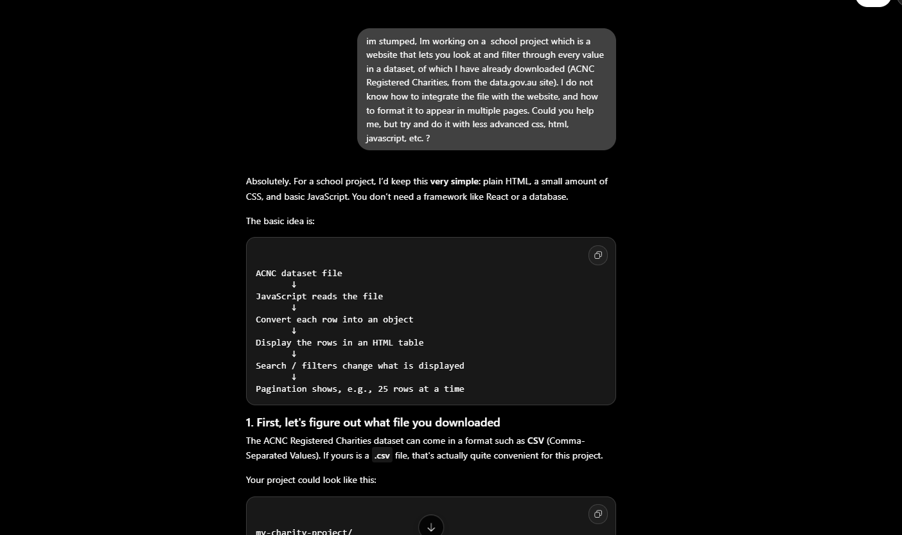

### For some parts of my project (e.g. integrating Javascript and CSV files to web), I used AI tools (Gemini, GPT).
### For most of the actual website design, I was using w3schools as my primary source for information and tutorials.
### I used some images from the web, which I may not have been licensed to use if this website were to go into public use.
